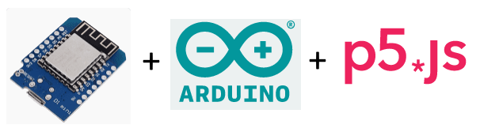
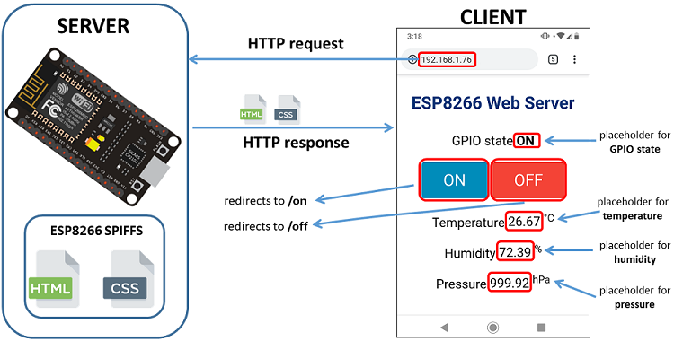
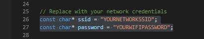
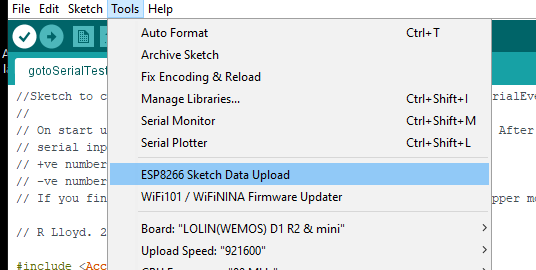

# p5-javascript-webserver: How to make a stupid-thing

Demonstration of a webserver serving a p5.js enabled webpage from an ESP8266 microcontroller.

**R. Lloyd**. Lincoln. May 2021.

---

There's something i've always wondered about this 'internet of things', 'thing'. How do you make one of these Things? What goes into them? I've used things like Tasmota for home automation and those things are basically an esp8266 and a mains relay. What we'll aminly be talking about here is the interface to things. There might be a sensor or servo here and there, but i'm more wanting to know about the UI for normal people and the websocket server backend so we're ready for the computer scientisets.

Well, here I am to share what I learn on this rambling journey into the Thingiv... dammit, that's taken... into the World of the Things... yeah, it's not as good.

## The World of the Things

First of all, I'm going to look at this tutorial, because it's using bootstrap as the css and js bit... so I should get the gist of it for when I want to use p5.js and do some sort of cool trippy graphics shit too.. that's a point, what other libraries can you serve? Oh yeah, most importantly, this is all based on the esp8266. Hopefully using SPIFFS... i don't know, I've not got that far yet... I should also say at this point, If you haven't installed the Arduino IDE, you'll need to do that and I'd suggest google is your friend throughout this whole process.

[How to create a beautiful Web Interface for projects ESP8266 / ESP32 with Bootstrap](https://diyprojects.io/bootstrap-create-beautiful-web-interface-projects-esp8266/#.YJG5IqEo-Uk)

Yeah.. I didn't follow that tutorial, I just looked at it. Follow that tutorial if you're coming at this from knowing how to use bootstrap. The arduino bit is just copypasta.

I want to understand how it all works so we can fiddle with things. The search continues...

This looks better:

[ESP8266 Web Server using SPIFFS (SPI Flash File System) – NodeMCU](https://randomnerdtutorials.com/esp8266-web-server-spiffs-nodemcu/)

Ok, this looks good

That will make you:

## 1. Install ESP8266 Board in Arduino IDE

    We’ll program the ESP8266 using Arduino IDE, so you must have the ESP8266 add-on installed. Follow the next tutorial to install it:

    [Install ESP8266 Board in Arduino IDE (Windows, Mac OS X, Linux)](https://randomnerdtutorials.com/how-to-install-esp8266-board-arduino-ide/) .... but you should have done this before now

Holdup... how about I save you the trouble. Go to the github repo:

https://github.com/esp8266/arduino-esp8266fs-plugin

Follow the instructions to install it the extra stuff in the arduino IDE

## 2. Filesystem Uploader Plugin

To upload files to the ESP8266 SPI Flash Filesystem (SPIFFS), we’ll use the Filesystem Uploader Plugin. Install the plugin in your Arduino IDE:

[Install ESP8266 Filesystem Uploader in Arduino IDE](https://randomnerdtutorials.com/install-esp8266-filesystem-uploader-arduino-ide/)

## 3. Installing Libraries

Apparently, one of the easiest ways to build a web server using files from the filesystem is using the [ESPAsyncWebServer](https://github.com/me-no-dev/ESPAsyncWebServer) library. 

## 4. Installing the ESPAsyncWebServer library

This library is not available to download through the Arduino IDE libraries manager. So, you need to follow the next steps to install the library:

[Click here to download the ESPAsyncWebServer library.](https://github.com/me-no-dev/ESPAsyncWebServer/archive/master.zip) You should have a .zip folder in your Downloads folder
Unzip the .zip folder and you should get ESPAsyncWebServer-master folder
Rename your folder from ESPAsyncWebServer-master to ESPAsyncWebServer
Move the ESPAsyncWebServer folder to your Arduino IDE installation libraries folder

Alternatively, you can go to Sketch > Include Library > .zip Library and select the previously downloaded library.

## 5. Installing the ESPAsyncTCP

https://github.com/me-no-dev/ESPAsyncTCP

https://github.com/me-no-dev/ESPAsyncTCP/archive/refs/heads/master.zip

The ESPAsyncWebServer library also needs the ESPAsyncTCP library to operate properly. Follow the next steps to install the ESPAsyncTCP library:

    Click here to download the ESPAsyncTCP library. You should have a .zip folder in your Downloads folder
    Unzip the .zip folder and you should get ESPAsyncTCP-master folder
    Rename your folder from ESPAsyncTCP-master to ESPAsyncTCP
    Move the ESPAsyncTCP folder to your Arduino IDE installation libraries folder
    Finally, re-open your Arduino IDE

Alternatively, you can go to Sketch > Include Library > .zip Library and select the previously downloaded library.

## And now the fun begins!

With all of that done, it's time to implement our own use. Fot this I am going to use the p5.js library for multiple reasons:

- It's a great library, based on [Processing3](https://www.processing.org), allowing the relatively simple generation of interactive 'sketches'.
- If you get stuck, you can check out 'The Coding Train' on Youtube.
- There is an [online editor](https://editor.p5js.org)
- We can simply copy the code from the 'data' folder associated with the sketch.

## 1. Find the code and open it in the Arduino IDE

I've prepared this github repository with a p5 version of Conways 'Game of life'. You're reading this document on it, so I'll assume you have downloaded it. If you're serious about getting into all of this, I'd suggest installing git and then doing:

    git clone https://github.com/rwlloyd/p5-javascript-webserver.git

## 2. Update the wifi details in the sketch.

Before you upload the sketch to your microcontroller, don't forget to change your wifi details in the .ino file, you were nearly all trying to connect to my wifi...

## 3. Upload the Arduino Sketch

To upload code to the esp8266, simply plug it in over usb and upload the sketch through the ArduinoIDE as you were shown in the things you googled earlier.  

Once the upload is complete, verify everything has worked by opening the serial monitor and get something that looks like this;

Obviously, or maybe not, your IP address is probably different to mine, but if you want to do a quick check it's actually there on your network, try:

    ping 192.168.1.87

This should get a response. That's all we're worried about right now. It won't do anything in a webbrowser, apart from maybe throw an error... We need some files to host. And with that in mind;

## 4. Upload to SPIFFS

This is done by simply using the tool that was installed during the tutorial above. It will look for a folder called 'data' in the current directory and then upload whatever is in it until the SPI flash memory on the microcontroller is full. 'FULL' full is bad. Also, theres a max filesystem size of 4MB if you don't want to be able to do OTA flashing and other fancy stuff.... apparently.

(I ran into trouble because i didn't have the correct board settings, namely the serial port I'd selected was wrong. The IDE didn't help me identify this at all. It just said 'no')

## 5. Play the 'Game of Life'

If you now go to the IP address that has recently appeared on you network, you should be presented with something that looks like this;

I don't remember exactly where I got the sketch from. But it probably came from following [Coding Challenge #85: The Game of Life](https://www.youtube.com/watch?v=FWSR_7kZuYg). I would encourage you to explore this channel if you're new to p5.js and coding in general. 

# The End of the Beginning

Thank you for reading all the way to the bottom of this document. I hope it was helpful. Now go and make something with your new found 'thing' skills. If youhave any comments, questions or issues, pull requests etc, please do those through the github repository. (It will help me learn how to use them)

